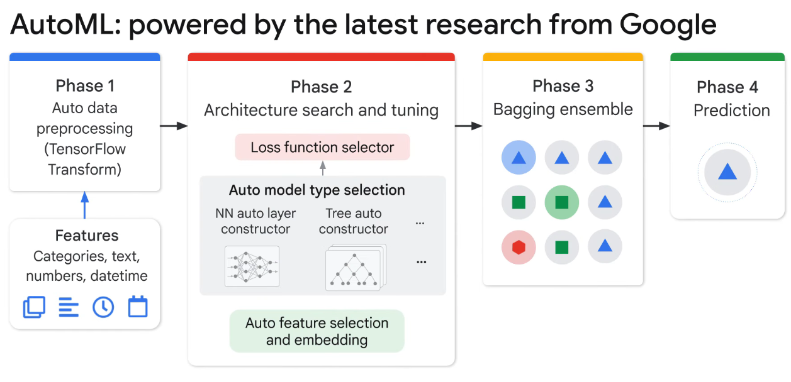
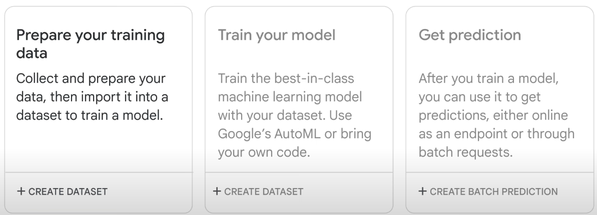

# AutoML

* Automated Machine Learning
* Auto the process to Training data, ML algorithm and deploy
* Announced in 2018 to save the manual work
* Since 2021, it has been embedded in VertexAI and have become part of the platform
*

    <figure><figcaption></figcaption></figure>
* Automated Feature Engineering:
*

    <figure><figcaption></figcaption></figure>
* Phase 2 includes - Neural Architecture Search and Transfer Learning
* Neural architecture searches the best model and tunes the parameters automatically
* **Transfer Learning:**
  * AutoML has already trained many different models with large amounts of data
  * These trained models can be used as a foundation model to solve new problem with new data
  * Lets people with less training data and less computation power to achieve greater results by using pre-trained models trained on similar larger dataset
* **Neural architecture search:**
  * The goal is to find optimal model among lot of models
  * Tried different models, and compares performance to find the best model
* LLMs:
  * LLM are general purpose language models that can be pre-trained and fine tuned for specific purposes
  * LLMs are trained to solve common language problems, such as - Text classification, Question answering, Document summarization and Text generation
  * Then they can be tailored to solve specific problems in different fields such as , Retail, finance etc
* The best models are assembled in Phase 3 and prepared for prediction in phase 4
* AutoML does not rely on single model, but on top of number of models (Typically around 10)
* The assembly can be as simple as averaging the predictions of the top number of models
*

    <figure><figcaption></figcaption></figure>
*
*
