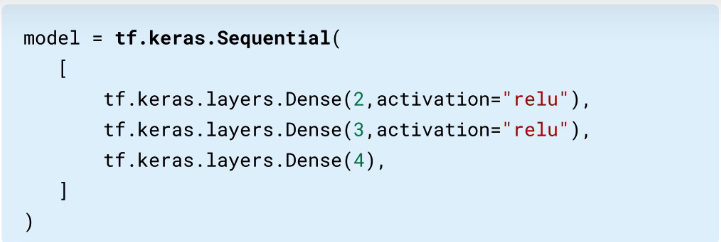
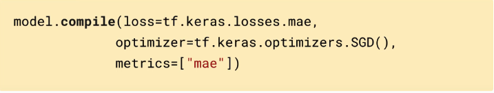
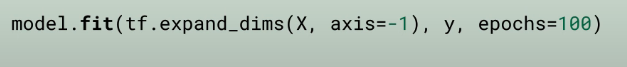

# Build ML model with TF

1. Create a model:
   1. Create layer of neural network
   2.

       <figure><figcaption></figcaption></figure>
2. Compile a model:
   1. Configuring the evaluation metrics and the optimization method
   2.

       <figure><figcaption></figcaption></figure>
3. Fit a model:
   1. Train the model to find the best fit
   2.

       <figure><figcaption></figcaption></figure>
