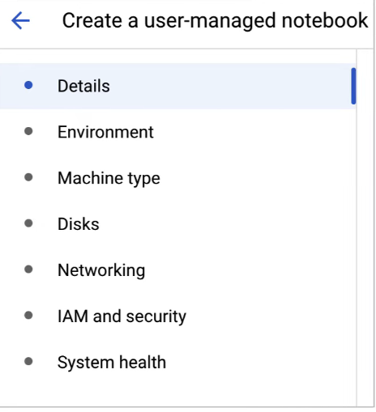

# Custom Training

* Before any coding begins, we need to determine what environment we want for ML training
  * Pre built container
    * If model needs a platform like Python, TF and PyTorch not particular about the underlying architecture to run on
  * Custom container
    * Determine the details like environment, machine type and and disks when creating the custom container
    *

        <figure><figcaption></figcaption></figure>
* We can consider Vertex AI workbench as a Jupyter notebook deployed in a single development environment that supports the entire data science workflow, from exporting to training abd then deploying a ML model
* We can also integrate colab enterprise into vertex ai colab
* ML library contains a collection of pre-written code&#x20;
*
