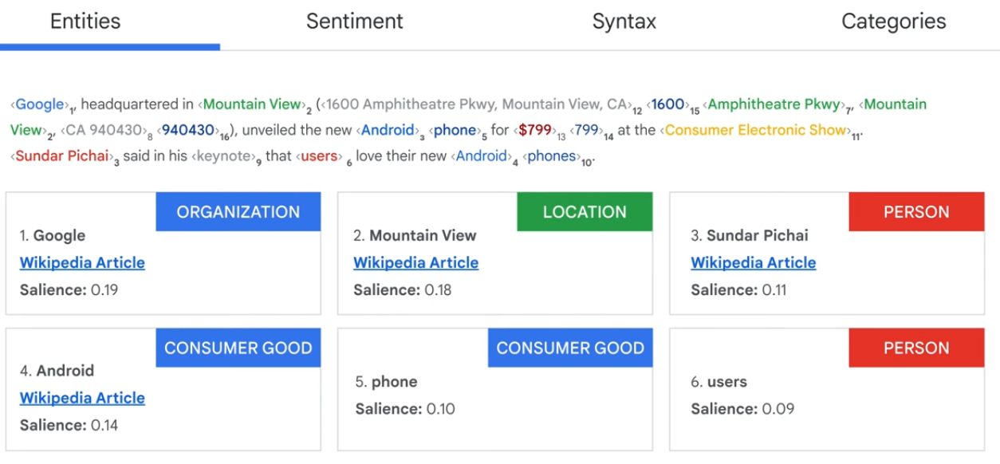

# Natural Language API

* [https://cloud.google.com/natural-language#demo](https://cloud.google.com/natural-language#demo)
* This would provide 4 types of analysis:
* Entity, Sentiments, Moderation and category
*

    <figure><figcaption></figcaption></figure>

