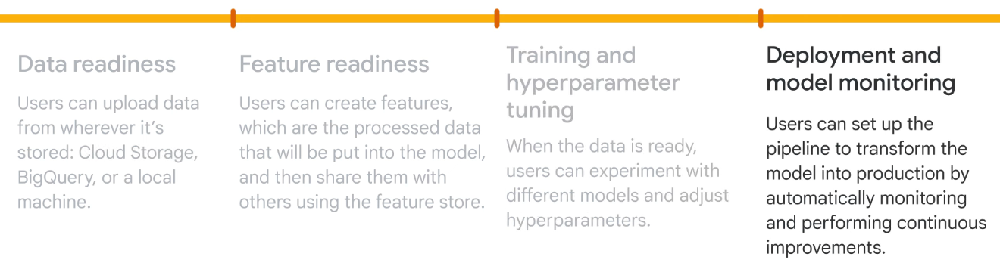

# Vertex AI

**Traditional Challenges:**

* Handling large quantities of data
* Determining the right ML model to train the data
* Harnessing the required amount of computing power

**Production Challenges:**

* Scalability&#x20;
* Monitoring
* CI, Delivery and training

**Ease-of-use challenges:**

* Tools require advanced coding skills
* Focus is taken away from model configuration
* There's no unified workflow
* Finding tools is difficult

* Vertex AI is a unified platform that solves this problem - predictive + generative AI
* It provides end to end ML pipeline - Prepare data, Create models, Deploy models, Manage models
*   Allows user to build ML models, with either AutoML(a no-code solution) or custom training(using code based solution)

    <figure><figcaption></figcaption></figure>
* Seamless, Scalable, Sustainable and speedy
*

