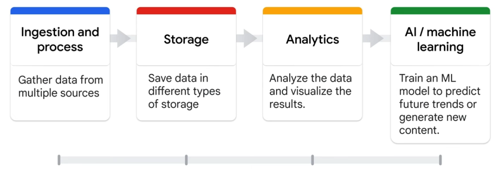

# Data to AI workflow

*

    <figure><figcaption></figcaption></figure>

**Products for Ingestion and Process:**

* (For real and batch data)
* Pub/Sub
* Dataflow
* Dataproc
* Cloud Data Fusion

**Storage:**

* Cloud Storage - Stores unstructured data
* BigQuery&#x20;
* Cloud SQL
* Spanner
* Bigtable
* Firestore

Analytics:

* BigQuery
* Looker

**Al/Machine learning:**

* Vertex AI (AutoML, Workbench, Colab Enterprise, Vertex AI Studio, Model garden)
