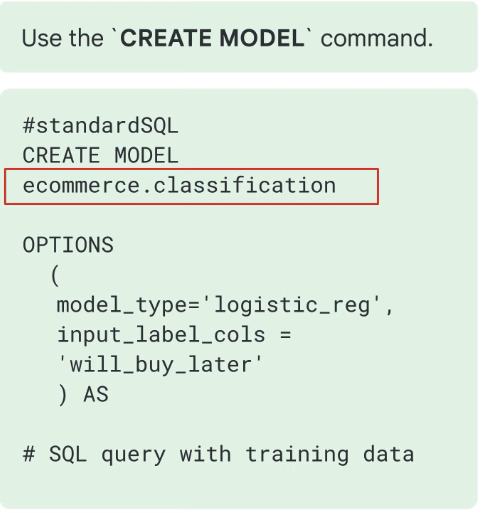
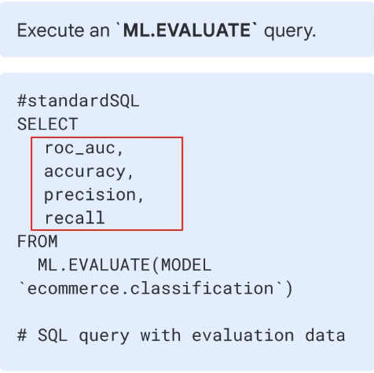
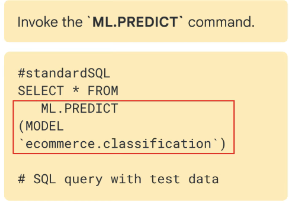

# Key phases of ML project

1. **Extract, transform and load data into BigQuery:**

* Look for connectors to get data into BigQuery before building the pipeline

2. **Select and preprocess features:**

* Use SQL to create the training dataset for the model to learn from
* BigQuery ML does some of the preprocessing like one hot encoding&#x20;

3. **Create the model inside BigQuery:**

*

    <figure><figcaption></figcaption></figure>

4. **Evaluate the performance of the trained model:**

*

    <figure><figcaption></figcaption></figure>

5. **Use the model to make predictions:**

*

    <figure><figcaption></figcaption></figure>
